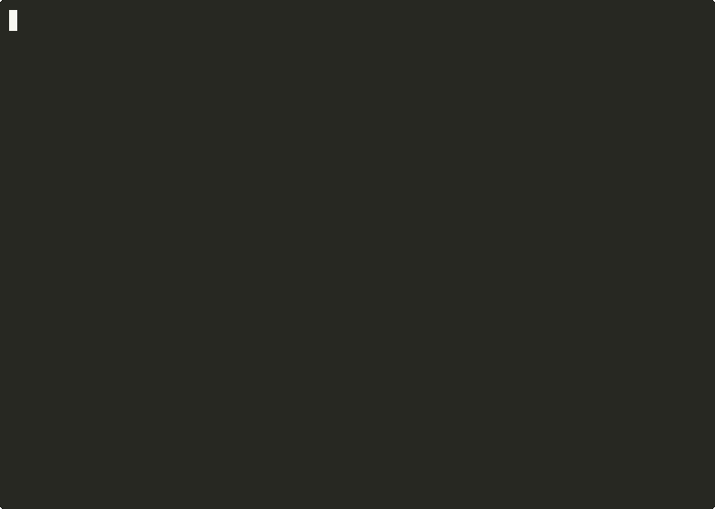

# CronGuard

[](https://github.com/dmazhukov/cronguard/actions/workflows/ci.yml)
[](https://github.com/dmazhukov/cronguard/releases/latest)
[](https://artifacthub.io/packages/helm/cronguard/cronguard)
[](https://goreportcard.com/report/github.com/dmazhukov/cronguard)
[](LICENSE)
[](go.mod)

**SLO-style observability for Kubernetes CronJobs.**

CronGuard is a small Kubernetes operator that wraps any existing `batch/v1.CronJob` with a `CronJobMonitor` custom resource. It watches child Jobs, tracks execution history, and exposes Prometheus metrics so you can alert on missed runs, duration overruns, and consecutive failures without hand-rolling PromQL against `kube-state-metrics`.

## Why

Kubernetes CronJobs fail silently in several common ways: a skipped run under `concurrencyPolicy: Forbid`, a Job that completes with no succeeded pods, control-plane drift pushing starts minutes late. Teams keep re-inventing the same fragile PromQL:

```promql
time() - kube_cronjob_status_last_successful_time{cronjob="..."} > 86400
```

CronGuard replaces that with a declarative SLO per CronJob.

## Quickstart

### Helm (OCI)

```bash
helm install cronguard oci://ghcr.io/dmazhukov/charts/cronguard \
  --version 0.2.6 \
  --namespace cronguard-system --create-namespace
```

### Helm (GitHub Pages)

```bash
helm repo add cronguard https://dmazhukov.github.io/cronguard/
helm repo update
helm install cronguard cronguard/cronguard --version 0.2.6 \
  --namespace cronguard-system --create-namespace
```

### Raw manifests

```bash
kubectl apply -f https://github.com/dmazhukov/cronguard/releases/download/v0.2.6/install.yaml
```

Apply a sample monitor:

```bash
kubectl apply -f config/samples/cronjob_example.yaml
kubectl apply -f config/samples/monitoring_v1alpha1_cronjobmonitor.yaml
kubectl get cronjobmonitors
# NAME                  SCHEDULE      LASTSUCCESS   CONSECFAILS   MISSED   READY   AGE
# nightly-settlement    0 2 * * *     5m            0             0        True    10m
```

See [docs/distribution.md](docs/distribution.md) for the full installation reference and all configuration knobs.

## Example

```yaml
apiVersion: monitoring.cronguard.io/v1alpha1
kind: CronJobMonitor
metadata:
  name: nightly-settlement
spec:
  cronJobRef:
    name: nightly-settlement
  schedule: "0 2 * * *"
  timeZone: "Europe/Moscow"      # optional; falls back to CronJob.spec.timeZone, then UTC
  maxDurationSeconds: 1800       # SLO: finish within 30 minutes
  maxConsecutiveFailures: 2      # alert after 2 failures in a row
  alertAfterMissedRuns: 2        # alert after 2 missed starts
  gracePeriodSeconds: 60
  historyLimit: 10
```

## Walkthrough

[](docs/cast/install.cast)

Recorded against a real `kind` cluster. Replay locally with:

```bash
asciinema play docs/cast/install.cast
```

Or open the [.cast file](docs/cast/install.cast) directly.

## Metrics

All metrics are labelled `{namespace, name, cronjob}`.

| Metric | Type | Meaning |
|---|---|---|
| `cronguard_last_success_timestamp_seconds` | gauge | Unix time of last successful Job |
| `cronguard_last_failure_timestamp_seconds` | gauge | Unix time of last failed Job |
| `cronguard_last_schedule_timestamp_seconds` | gauge | Unix time of last Job start (success or failure) |
| `cronguard_running_jobs` | gauge | Currently-running Jobs owned by the watched CronJob |
| `cronguard_next_expected_timestamp_seconds` | gauge | Unix time of next expected run |
| `cronguard_consecutive_failures` | gauge | Consecutive failed runs |
| `cronguard_missed_runs` | gauge | Consecutive missed runs |
| `cronguard_schedule_drift_seconds` | gauge | Drift of most recent run |
| `cronguard_last_duration_seconds` | gauge | Duration of last completed run |
| `cronguard_condition` | gauge | `1`/`0`/`-1` per condition type/reason |

Example alerts (PromQL):

```promql
# No success in 25 hours for a daily CronJob
(time() - cronguard_last_success_timestamp_seconds) > 90000

# Execution SLO breached
cronguard_condition{type="ExecutionHealthy"} == 0
```

## Dashboards

A pre-built Grafana dashboard ships under [`config/grafana/`](config/grafana/) — six panels covering all CronGuard metrics. See [the dashboards README](config/grafana/README.md) for import instructions.

## Architecture

```
  User applies CronJobMonitor YAML
           │
           ▼
    apiserver ──► Reconciler ──► computes SLO ──► patches .status
           ▲                            │
           └──── Job events (informer) ─┘

    /metrics scrape ──► Collector reads cache ──► emits cronguard_*
```


## Roadmap

Shipped (v0.2.x): operator core, CRD, envtest suite, raw manifests, Prometheus metrics, Helm chart (OCI + GitHub Pages), Grafana dashboard, default `PrometheusRule`, `ServiceMonitor`, kind-based e2e, Artifact Hub listing, timezone-aware schedules (`spec.timeZone` with fallback to `CronJob.spec.timeZone`).

Considered for v0.3+: admission webhook (CEL validation), OLM bundle, burn-rate alerts.

## Development

```bash
# Run unit + envtest
make test

# Run the manager against your current kube-context
make run

# Build a local Docker image
make docker-build IMG=cronguard:dev
```

## Contributing

See [CONTRIBUTING.md](CONTRIBUTING.md).

## Security

See [SECURITY.md](SECURITY.md).

## License

Apache 2.0 — see [LICENSE](LICENSE).
